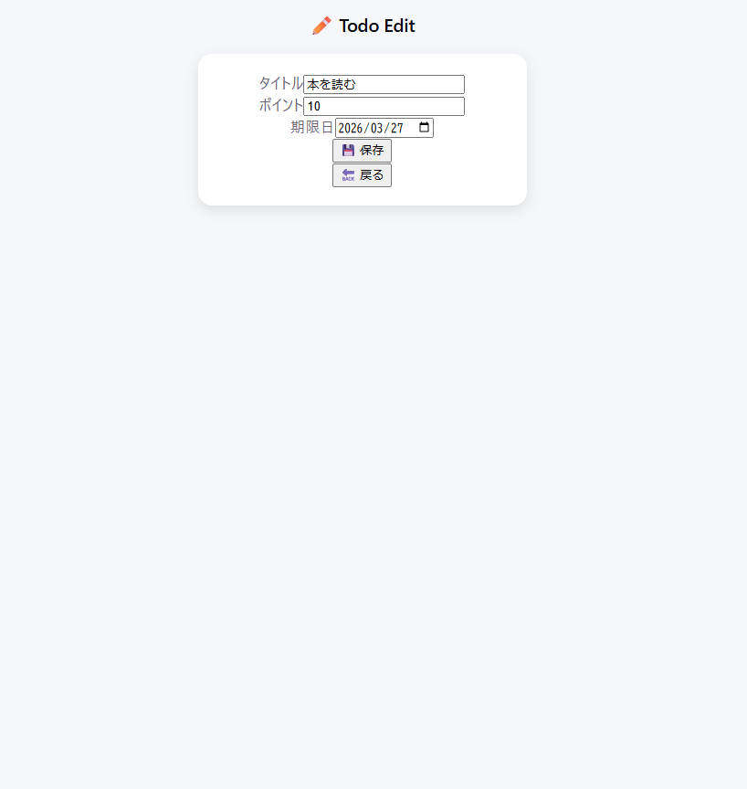

## 🔗 関連リポジトリ
バックエンドはこちら👇  
https://github.com/la-france45/famstep2-backend

# FamStep2
親子で楽しく継続できる、ポイント制TODO管理アプリ
（React × Spring Boot / セッション認証 / UX重視）

## ■ アプリ概要
親子で目標達成をサポートする、ポイント制のTODO管理アプリです。
子どもはミッション（TODO）をクリアしてポイントを獲得し、レベルアップや目標達成を目指します。
親は子どものタスクやポイントを管理し、成長を可視化できます。

## ■ 開発背景
「子どもが楽しみながら継続できる仕組み」をテーマに開発しました。
単なるTODO管理ではなく、以下を重視しています。
ゲーム感覚で取り組める設計
成長が見える仕組み（レベル・ポイント）
親子で共有できる体験

## ■ 主な機能
👨‍👩‍👧 親ユーザー
子ユーザーのTODO進捗状況確認
TODO作成・編集・削除
ポイントの手動調整（誤操作対応）
目標ポイントの設定
ポイントリセット
🧒 子ユーザー
TODO一覧表示
TODO完了（ポイント獲得）
レベルアップ演出（動画）
目標達成演出（動画）

## ■ 画面イメージ

### ログイン画面

### 親ユーザートップ

### TODO管理画面

### TODO編集画面

### ポイント管理画面

### 子ユーザートップ

### レベルアップ&目標ポイント達成演出

## ■ 特徴・工夫した点
① ユーザー体験（UX）を重視した設計
ポイント獲得時のエフェクト表示
レベルアップ・目標達成時のアニメーション演出
→ ゲーム感覚で継続できる体験を設計

② 認証・セッション管理
ログイン情報をSessionで管理
/api/me によるログイン状態確認
未ログイン時の画面制御
→ フロントとバックエンドの連携を意識した設計

③ カスタムフックによる共通化（React）
useAuth() を作成
全画面でログインチェックを共通化
ローディング制御による画面チラつき防止
→ 保守性・再利用性を意識

④ コンポーネント設計
Headerでログアウト処理を共通化
各画面ごとに責務を分離
→ 実務を意識した構成

## ■ 使用技術
フロントエンド
React
React Router
CSS
バックエンド
Java（Spring Boot）
REST API
セッション認証
その他
MySQL
Lombok
DTO設計（JSONベース）

## ■ API一覧

### ■ 認証系
| メソッド | エンドポイント | 内容 |
|----------|---------------|------|
| POST | /api/login | ログイン |
| GET | /api/me | ログイン情報取得 |
| POST | /api/logout | ログアウト |

### ■ ユーザー管理
| メソッド | エンドポイント | 内容 |
|----------|---------------|------|
| GET | /api/users | ユーザー一覧取得 |
| GET | /api/users/{id} | ユーザー詳細取得 |
| PUT | /api/users/{id}/point | ポイント更新 |
| PUT | /api/users/{id}/goal | 目標設定 |
| PUT | /api/users/{id}/point/reset | ポイントリセット |

### ■ TODO管理
| メソッド | エンドポイント | 内容 |
|----------|---------------|------|
| GET | /api/todos | TODO一覧取得 |
| GET | /api/todos?childId={id} | 子ユーザーのTODO取得 |
| POST | /api/todos | TODO作成 |
| PUT | /api/todos/{id} | TODO更新 |
| DELETE | /api/todos/{id} | TODO削除 |
| PUT | /api/todos/{id}/complete | TODO完了 |

## ■ 苦労した点
セッション管理とフロント側制御の連携
非同期処理による画面チラつき問題
状態更新後の再取得処理（データ整合性）

## ■ 今後の改善
JWT認証への変更
親→子IDの状態管理改善（URL依存の排除）
通知機能の追加
UI/UXのブラッシュアップ

## ■ 環境構築
前提
MySQLをローカルで起動
手順
バックエンド（Spring Boot）を起動
フロントエンド（React）を起動
ブラウザでアクセス
※ DB接続情報は application.properties を設定してください

